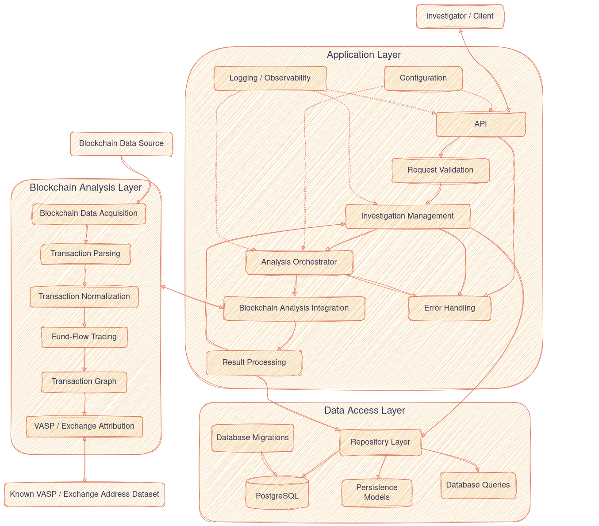
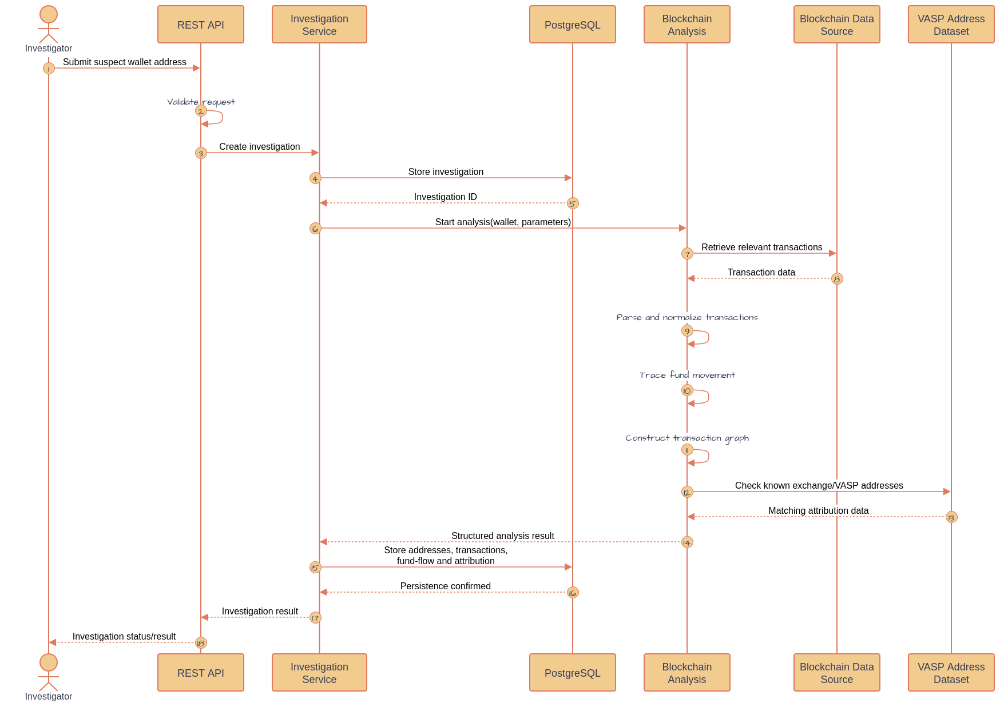
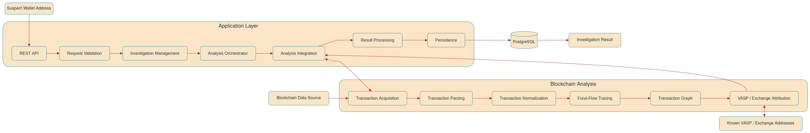

# High-Level Design

## Architecture

The system is divided into application, data-access, database, and blockchain-analysis responsibilities.

The application layer receives and validates investigation requests, manages investigations, orchestrates blockchain analysis through an integration boundary, processes results, and persists them through the repository/data-access layer into the database (PostgreSQL).

The blockchain-analysis layer handles transaction acquisition, parsing, normalization, fund-flow tracing, graph construction, and VASP/exchange attribution, while configuration and observability support the application across these components.



## Component Responsibilities

### Go Backend

> The Go backend owns the application-level work.

Responsibilities:

- accept investigation requests
- validate wallet addresses
- create investigation records
- request blockchain analysis
- receive analysis results
- persist analysis results
- retrieve previous investigations
- expose investigation results through the REST API
- handle application errors
- coordinate the different components
- provide logging and basic observability
- run backend and integration tests

The backend should not contain the blockchain tracing algorithms themselves.

### PostgreSQL

> PostgreSQL stores application and investigation data.

It should contain:

- investigations
- addresses involved in investigations
- relevant transactions
- relationships between transactions and addresses
- known exchange/VASP entities & addresses
- analysis results and attribution information where required

### Blockchain Analysis Component

> The blockchain analysis component owns blockchain-specific processing.

Responsibilities:

- obtain blockchain transaction data
- parse and normalize transactions
- trace funds from the supplied address
- construct the relevant transaction graph
- identify intermediary addresses
- compare destinations against known exchange/VASP addresses
- return a structured analysis result so the application layer can work with it

### Blockchain Data Source

The MVP will use one blockchain and one suitable data source.
The data source may be an API, RPC endpoint, node, or another appropriate source depending on the blockchain selected.
This decision will be made soon after the evaluation of the available options.

### Known Exchange/VASP Dataset

The MVP will use a small, controlled dataset of known exchange/VASP addresses.  
The dataset should contain enough information to associate a known blockchain address with an exchange/VASP entity.  
This is not intended to provide complete exchange wallet coverage.

## Investigation Sequence

An investigation starts with a wallet address reported as suspicious.



## Analysis Result

The blockchain analysis component should return structured information rather than presentation-specific output.

The result should be sufficient for the backend to store and expose:

- submitted wallet address
- relevant transactions
- traced addresses
- fund movement relationships
- intermediary addresses
- identified exchange/VASP, if any
- attribution confidence or status
- supporting transaction information
- analysis metadata

The backend should remain responsible for deciding how this information is exposed through the API.

## Boundary Between Components

The boundary should be language-independent.

The blockchain analysis component should expose a clearly defined interface that accepts an analysis request and returns a structured analysis result.

For the MVP, JSON over HTTP is a practical option because the blockchain-analysis implementation does not need to use Go.

```
Go Backend
    |
    | Analysis Request
    | {wallet_address, depth, ...}
    v
Blockchain Analysis Component
    |
    | Analysis Result
    | {transactions, addresses, attribution, ...}
    v
Go Backend
    |
    v
PostgreSQL
```

The exact protocol can be changed if implementation constraints make another approach more appropriate.

## Data Flow


