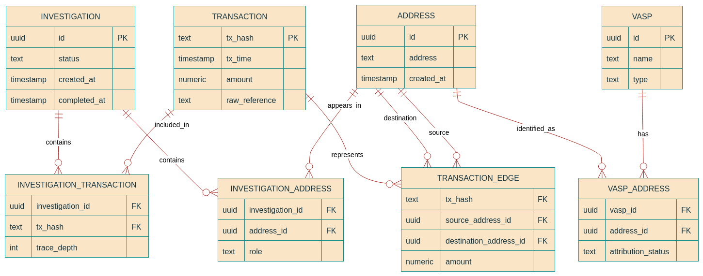

# Database Design

## Overview

PostgreSQL will be used as the persistent store for investigation data and blockchain-analysis results.  
The database should store the information required to reproduce and inspect an investigation without storing unnecessary blockchain data.  
The MVP database is designed around an investigation and the addresses and transactions relevant to that investigation.

## Main Entities

The MVP uses the following main entities:

- Investigation
- Address
- Investigation Address
- Transaction
- Investigation Transaction
- Transaction Edge
- VASP
- VASP Address

## Entity Relationships



## Investigation

Represents one analysis request.

Fields:

- `id` (uuid, primary key): unique identifier for the investigation
- `status` (text): current state of the investigation
- `created_at` (timestamp): timestamp when the investigation was created
- `completed_at` (timestamp): timestamp when the investigation finished processing

Possible statuses:

```
pending
running
completed
failed
```

The investigation is the top-level application entity. The submitted suspect address is linked to the investigation through `investigation_address` with the role `suspect`.

## Address

Stores unique blockchain addresses encountered during an investigation.

Fields:

- `id` (uuid, primary key): unique identifier for the address record
- `address` (text): blockchain address value
- `created_at` (timestamp): timestamp when the address record was created

The same address may appear in multiple investigations, so addresses should not be duplicated unnecessarily. In line with the single-blockchain MVP scope, an address is uniquely identified by its address value.

## Transaction

Stores relevant transaction information returned by the blockchain-analysis component.

Fields:

- `tx_hash` (text, primary key): blockchain transaction identifier
- `tx_time` (timestamp): time the transaction was confirmed or recorded
- `amount` (numeric): transaction value or transfer amount
- `raw_reference` (text): reference to raw transaction data or payload

The MVP should store only the transaction information required by the application.

## Investigation Address

Associates an address with an investigation and records its role.

Fields:

- `investigation_id` (uuid, foreign key -> investigation.id): associated investigation
- `address_id` (uuid, foreign key -> address.id): associated address
- `role` (text): role of the address within the investigation

Example roles:

```
suspect
intermediary
destination
other
```

## Investigation Transaction

Associates a transaction with an investigation.

Fields:

- `investigation_id` (uuid, foreign key -> investigation.id): associated investigation
- `tx_hash` (text, foreign key -> transaction.tx_hash): associated transaction
- `trace_depth` (int): hop distance from the suspect address

The trace depth allows the application to distinguish between transactions directly related to the suspect address and transactions discovered further along the trace.

## Transaction Edge

Represents a movement of funds from one address to another within a relevant transaction.

Fields:

- `tx_hash` (text, foreign key -> transaction.tx_hash): associated transaction
- `source_address_id` (uuid, foreign key -> address.id): originating address
- `destination_address_id` (uuid, foreign key -> address.id): receiving address
- `amount` (numeric): amount transferred along this edge

This provides a simple representation of the fund-flow graph.

## VASP

Represents a known exchange or other VASP.

Fields:

- `id` (uuid, primary key): unique identifier for the VASP
- `name` (text): name of the exchange or entity
- `type` (text): category of the entity (e.g. exchange)

The MVP does not attempt to maintain a complete global VASP registry.

## VASP Address

Associates a known blockchain address with a VASP.

Fields:

- `vasp_id` (uuid, foreign key -> vasp.id): associated VASP entity
- `address_id` (uuid, foreign key -> address.id): associated blockchain address
- `attribution_status` (text): attribution confidence or classification

The attribution status can represent how strongly the address is associated with that entity.

For example:

```
known
probable
unverified
```

The exact attribution model is yet to be decided.

## Important Database Principles

### Blockchain-specific complexity should be kept out of the application schema where possible

The backend should store a normalized representation that it can work with. Blockchain-specific raw data should not dictate the entire application design.

### Not every address is guaranteed to have a known owner

An address may have no known VASP association. The database must allow an investigation to complete without an attribution.

### Attribution should not be treated as absolute identity

A known address association should represent evidence or attribution information, not automatically imply the real-world identity of the person controlling the original suspect wallet.

### Supporting transaction information should be preserved

Transaction hashes and relevant transaction details should be retained so that an investigator can inspect the basis of the result.

## Indexing

Indexes should be added for fields that are frequently queried.

At least on:

- investigation creation time (`investigation.created_at`)
- investigation status (`investigation.status`)
- address value (`address.address`)
- investigation/address relationships (`investigation_address.investigation_id`, `investigation_address.address_id`)
- investigation/transaction relationships (`investigation_transaction.investigation_id`, `investigation_transaction.tx_hash`)
- transaction edge addresses and transactions (`transaction_edge.tx_hash`, `transaction_edge.source_address_id`, `transaction_edge.destination_address_id`)
- VASP address mappings (`vasp_address.address_id`, `vasp_address.vasp_id`)

Indexes should be added based on actual query requirements rather than adding indexes to every column.

## Migrations

The schema should be managed through database migrations rather than manually creating the production schema.
Each schema change should have a corresponding migration.
