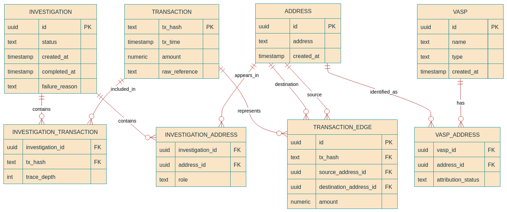

# Database Design

## Overview

PostgreSQL will be used as the persistent store for investigation data and blockchain-analysis results.  
The database should store the information required to reproduce and inspect an investigation without storing unnecessary blockchain data.  
The MVP database is designed around an investigation and the addresses and transactions relevant to that investigation.

## Main Entities

The MVP uses the following main entities:

- Investigation
- Address
- Investigation Address
- Transaction
- Investigation Transaction
- Transaction Edge
- VASP
- VASP Address

## Entity Relationships



## Investigation

Represents one analysis request.

Fields:

- `id` (uuid, primary key): unique identifier for the investigation, generated via `gen_random_uuid()`
- `status` (text, not null): current state of the investigation with check constraint
- `created_at` (timestamptz, not null): timestamp when the investigation was created (default `now()`)
- `completed_at` (timestamptz, nullable): timestamp when the investigation finished processing
- `failure_reason` (text, nullable): explanation of the failure if status is `failed`

Valid statuses (enforced via `CHECK (status IN ('pending', 'running', 'completed', 'failed'))`):

```
pending
running
completed
failed
```

The investigation is the top-level application entity. The submitted suspect address is linked to the investigation through `investigation_address` with the role `suspect`.

## Address

Stores unique blockchain addresses encountered during an investigation.

Fields:

- `id` (uuid, primary key): unique identifier for the address record, generated via `gen_random_uuid()`
- `address` (text, not null, unique): blockchain address value
- `created_at` (timestamptz, not null): timestamp when the address record was created (default `now()`)

The same address may appear in multiple investigations, so addresses are not duplicated. An address is uniquely identified by its address value.

## Transaction

Stores relevant transaction information returned by the blockchain-analysis component.

Fields:

- `tx_hash` (text, primary key): blockchain transaction identifier
- `tx_time` (timestamptz, not null): time the transaction was confirmed or recorded
- `amount` (numeric, not null): transaction value or transfer amount
- `raw_reference` (text, not null, default `''`): reference to raw transaction data or payload

The MVP stores only the transaction information required by the application.

## Investigation Address

Associates an address with an investigation and records its role.

Fields:

- `investigation_id` (uuid, foreign key -> investigation.id ON DELETE CASCADE)
- `address_id` (uuid, foreign key -> address.id ON DELETE CASCADE)
- `role` (text, not null): role of the address within the investigation with check constraint

Primary key: `(investigation_id, address_id)`

Valid roles (enforced via `CHECK (role IN ('suspect', 'intermediary', 'destination', 'other'))`):

```
suspect
intermediary
destination
other
```

## Investigation Transaction

Associates a transaction with an investigation.

Fields:

- `investigation_id` (uuid, foreign key -> investigation.id ON DELETE CASCADE)
- `tx_hash` (text, foreign key -> transaction.tx_hash ON DELETE CASCADE)
- `trace_depth` (int, not null, default 1): hop distance from the suspect address

Primary key: `(investigation_id, tx_hash)`

The trace depth allows the application to distinguish between transactions directly related to the suspect address and transactions discovered further along the trace.

## Transaction Edge

Represents a movement of funds from one address to another within a relevant transaction.

Fields:

- `id` (uuid, primary key): unique identifier for the edge, generated via `gen_random_uuid()`
- `tx_hash` (text, foreign key -> transaction.tx_hash ON DELETE CASCADE)
- `source_address_id` (uuid, foreign key -> address.id ON DELETE CASCADE): originating address
- `destination_address_id` (uuid, foreign key -> address.id ON DELETE CASCADE): receiving address
- `amount` (numeric, not null): amount transferred along this edge

This provides a direct, queryable representation of the fund-flow graph.

## VASP

Represents a known exchange or other VASP.

Fields:

- `id` (uuid, primary key): unique identifier for the VASP, generated via `gen_random_uuid()`
- `name` (text, not null, unique): name of the exchange or entity
- `type` (text, not null): category of the entity (e.g. `exchange`)
- `created_at` (timestamptz, not null): timestamp when the entity record was created (default `now()`)

The MVP does not attempt to maintain a complete global VASP registry.

## VASP Address

Associates a known blockchain address with a VASP.

Fields:

- `vasp_id` (uuid, foreign key -> vasp.id ON DELETE CASCADE)
- `address_id` (uuid, foreign key -> address.id ON DELETE CASCADE)
- `attribution_status` (text, not null): attribution confidence or classification with check constraint

Primary key: `(vasp_id, address_id)`

Valid attribution statuses (enforced via `CHECK (attribution_status IN ('known', 'probable', 'unverified'))`):

```
known
probable
unverified
```

## Important Database Principles

### Blockchain-specific complexity should be kept out of the application schema where possible

The backend should store a normalized representation that it can work with. Blockchain-specific raw data should not dictate the entire application design.

### Not every address is guaranteed to have a known owner

An address may have no known VASP association. The database must allow an investigation to complete without an attribution.

### Attribution should not be treated as absolute identity

A known address association should represent evidence or attribution information, not automatically imply the real-world identity of the person controlling the original suspect wallet.

### Supporting transaction information should be preserved

Transaction hashes and relevant transaction details should be retained so that an investigator can inspect the basis of the result.

## Indexing Strategy

Indexes are defined for foreign key lookups, graph traversals, and query filters. Leading columns of composite primary keys provide natural indexing for those columns, while secondary indexes cover lookups on the remaining foreign keys:

| Index Name                                    | Table                       | Columns                  | Purpose                                         |
| :-------------------------------------------- | :-------------------------- | :----------------------- | :---------------------------------------------- |
| `idx_investigation_created_at`                | `investigation`             | `created_at`             | Chronological ordering of investigations        |
| `idx_investigation_status`                    | `investigation`             | `status`                 | Filtering active, running, or pending jobs      |
| `idx_investigation_address_address_id`        | `investigation_address`     | `address_id`             | Reverse lookup of investigations by address     |
| `idx_investigation_transaction_tx_hash`       | `investigation_transaction` | `tx_hash`                | Reverse lookup of investigations by transaction |
| `idx_transaction_edge_tx_hash`                | `transaction_edge`          | `tx_hash`                | Edge lookups by transaction identifier          |
| `idx_transaction_edge_source_address_id`      | `transaction_edge`          | `source_address_id`      | Graph forward traversal (outgoing fund flows)   |
| `idx_transaction_edge_destination_address_id` | `transaction_edge`          | `destination_address_id` | Graph backward traversal (incoming fund flows)  |
| `idx_vasp_address_address_id`                 | `vasp_address`              | `address_id`             | Attribution lookups for a given address         |

## Migrations and Tooling

The schema is managed through database migrations rather than manual schema alterations.

- Tooling: `pressly/goose` CLI.
- Location: `migrations/` directory at repository root.
- Convention: Sequential SQL files with `-- +goose Up` and `-- +goose Down` statements (`00001_initial_schema.sql`).
- Commands (via `Makefile`):
  - `make migrate-status`: View applied and pending migrations.
  - `make migrate-up`: Apply all pending migrations.
  - `make migrate-down`: Roll back the most recent migration.
  - `make migrate-create NAME=<name>`: Scaffold a new SQL migration file.

## Connection Management and Pooling

Database connectivity is managed through `github.com/jackc/pgx/v5/pgxpool`:

- Initialisation enforces fail-fast validation via an immediate `Ping(ctx)` on application startup.
- Connection limits and timeouts:
  - `MaxConns`: 25
  - `MinConns`: 2
  - `MaxConnLifetime`: 1 hour
  - `MaxConnIdleTime`: 15 minutes
  - `HealthCheckPeriod`: 1 minute
- The connection pool is instantiated in `cmd/api/main.go` and closed gracefully on shutdown.
